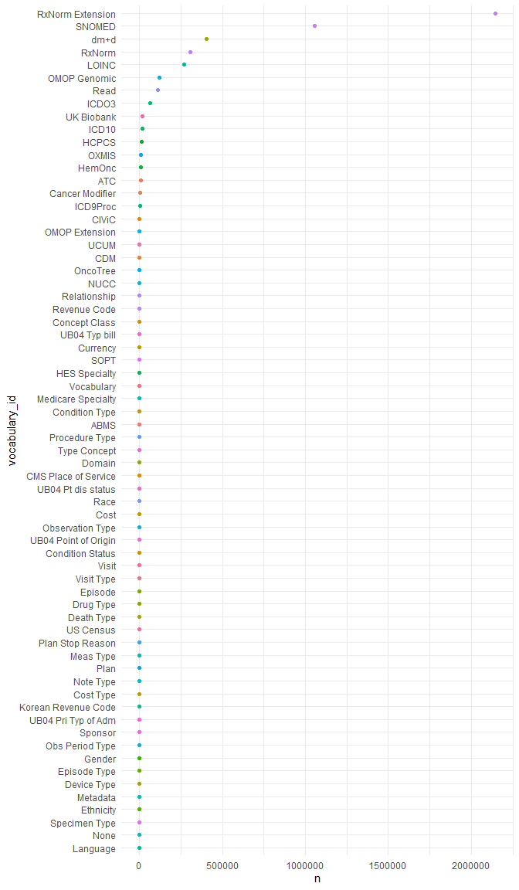

<!-- README.md is generated from README.Rmd. Please edit that file -->
<!-- use devtools::build_readme() -->

# omopcept

<!-- badges: start -->
<!-- badges: end -->

omopcept provides access to a subset of **OMOP** con**CEPT**s (without
the cons!) and flexible tidyverse compatible R functions for querying.
It includes concise named copies of functions designed for interactive
use e.g. `oid()` and `onames()` to search concept ids and names
respectively.

## Installation

Install the development version of omopcept with:

``` r
# install.packages("remotes")

remotes::install_github("andysouth/omopcept")
```

## Getting started with omopcept

On initial use omopcept downloads a
[parquet](https://parquet.apache.org/) file containing the concepts to a
local package cache where it can be accessed in future sessions. On use
it opens the file (with omop_concept()) but doesn’t read in all the data
to save time. The [arrow R
package](https://arrow.apache.org/docs/r/index.html) allows parquet
files to be opened and queried in dplyr pipelines without having to read
in all the data. e.g. the code below will return just the top rows of
the concept table.

``` r

library(omopcept)

omop_concept() |> 
  head() |> 
  dplyr::collect()
```

## Main omopcept functions

| full name              | quick interactive name | action                                                                    |
|------------------------|------------------------|---------------------------------------------------------------------------|
| `omop_names()`         | `onames()`             | search concepts by parts of names                                         |
| `omop_id()`            | `oid()`                | search for a concept_id                                                   |
| `omop_join_name()`     | `ojoin()`              | join an omop name column onto a table with an id column                   |
| `omop_join_name_all()` | `ojoinall()`           | join omop names columns onto all id columns in a table                    |
| `omop_concept()`       | `oc()`                 | return reference to the concept table that can be used in dplyr pipelines |

## OMOP background

The [OMOP Common Data Model](https://ohdsi.github.io/CommonDataModel/)
is an open standard for health data. “\[It is\] designed to standardize
the structure and content of observational data and to enable efficient
analyses that can produce reliable evidence”.

OMOP is maintained by OHDSI (pronounced “Odyssey”). “The Observational
Health Data Sciences and Informatics program is a multi-stakeholder,
interdisciplinary collaborative that strives to improve medical decision
making and bring better health outcomes to patients around the world.”  
OMOP concepts can be searched and downloaded from [Athena – the OHDSI
vocabularies repository](https://athena.ohdsi.org). This package
provides R tools to interact with the concepts in a more reproducible
way.

## Concept data

OMOP vocab data downloaded from Athena includes a table called
CONCEPT.csv that we saved in parquet format for use in this package.

omopcept downloads a selection of vocabularies and stores locally the
first time you use it.

| fields           | about                               | query_arguments |
|:-----------------|:------------------------------------|:----------------|
| concept_id       | unique id                           | c_ids           |
| concept_name     | descriptive name                    | pattern         |
| domain_id        | e.g. drug, measurement              | d_ids           |
| vocabulary_id    | e.g. LOINC, SNOMED                  | v_ids           |
| concept_class_id | e.g. Clinical Observation, Organism | cc_ids          |
| standard_concept | standard or not                     | standard        |
| concept_code     | source code                         |                 |
| valid_start_date |                                     |                 |
| valid_end_date   |                                     |                 |
| invalid_reason   |                                     |                 |

## String search in concept_name field

``` r

omop_names("chemotherapy", v_ids="LOINC")
#> # A tibble: 71 × 10
#>    conce…¹ conce…² domai…³ vocab…⁴ conce…⁵ stand…⁶ conce…⁷ valid_st…⁸ valid_en…⁹
#>      <int> <chr>   <chr>   <chr>   <chr>   <chr>   <chr>   <date>     <date>    
#>  1 3010410 Chemot… Observ… LOINC   Clinic… S       11486-8 1970-01-01 2099-12-31
#>  2 3002377 Chemot… Measur… LOINC   Clinic… S       21881-8 1970-01-01 2099-12-31
#>  3 3011998 Date 1… Observ… LOINC   Clinic… S       21927-9 1970-01-01 2099-12-31
#>  4 3003037 Chemot… Measur… LOINC   Clinic… S       21946-9 1970-01-01 2099-12-31
#>  5 3000897 Reason… Measur… LOINC   Clinic… S       21951-9 1970-01-01 2099-12-31
#>  6 3014397 Chemot… Measur… LOINC   Clinic… S       21967-5 1970-01-01 2099-12-31
#>  7 3027104 Chemot… Measur… LOINC   Clinic… S       22041-8 1970-01-01 2099-12-31
#>  8 3037369 2nd co… Measur… LOINC   Clinic… S       42045-5 2005-08-05 2099-12-31
#>  9 3032293 3rd co… Measur… LOINC   Clinic… S       42051-3 2005-08-05 2099-12-31
#> 10 3028808 4th co… Measur… LOINC   Clinic… S       42057-0 2005-08-05 2099-12-31
#> # … with 61 more rows, 1 more variable: invalid_reason <chr>, and abbreviated
#> #   variable names ¹​concept_id, ²​concept_name, ³​domain_id, ⁴​vocabulary_id,
#> #   ⁵​concept_class_id, ⁶​standard_concept, ⁷​concept_code, ⁸​valid_start_date,
#> #   ⁹​valid_end_date

omop_names("chemotherapy", v_ids=c("LOINC","SNOMED"), d_ids=c("Observation","Procedure"))
#> # A tibble: 297 × 10
#>    conce…¹ conce…² domai…³ vocab…⁴ conce…⁵ stand…⁶ conce…⁷ valid_st…⁸ valid_en…⁹
#>      <int> <chr>   <chr>   <chr>   <chr>   <chr>   <chr>   <date>     <date>    
#>  1  3.01e6 Chemot… Observ… LOINC   Clinic… S       11486-8 1970-01-01 2099-12-31
#>  2  3.01e6 Date 1… Observ… LOINC   Clinic… S       21927-9 1970-01-01 2099-12-31
#>  3  3.05e6 Chemot… Observ… LOINC   Survey  S       45841-4 1970-01-01 2099-12-31
#>  4  4.08e7 Chemot… Observ… LOINC   Survey  S       54992-3 2009-01-26 2099-12-31
#>  5  4.08e7 Chemot… Observ… LOINC   Survey  S       54993-1 2009-01-26 2099-12-31
#>  6  4.08e7 Type o… Observ… LOINC   Clinic… S       63938-5 2011-03-15 2099-12-31
#>  7  4.08e7 Cancer… Observ… LOINC   Clinic… S       66178-5 2011-06-02 2099-12-31
#>  8  4.08e7 Have y… Observ… LOINC   Clinic… S       67446-5 2011-07-11 2099-12-31
#>  9  4.08e7 Histor… Observ… LOINC   Clinic… S       67469-7 2011-07-12 2099-12-31
#> 10  3.63e7 Chemot… Observ… LOINC   Clinic… S       88060-9 2018-06-15 2099-12-31
#> # … with 287 more rows, 1 more variable: invalid_reason <chr>, and abbreviated
#> #   variable names ¹​concept_id, ²​concept_name, ³​domain_id, ⁴​vocabulary_id,
#> #   ⁵​concept_class_id, ⁶​standard_concept, ⁷​concept_code, ⁸​valid_start_date,
#> #   ⁹​valid_end_date
```

## Join OMOP names onto a dataframe containing concept ids in a column called \*concept_id

Helps to interpret OMOP data.

``` r


data.frame(concept_id=(c(3571338L,4002075L))) |> 
  omop_join_name()
#>   concept_id      concept_name
#> 1    3571338 Problem behaviour
#> 2    4002075       BLUE LOTION
 

data.frame(drug_concept_id=(c(4000794L,4002592L))) |> 
  omop_join_name(namestart="drug")
#>   drug_concept_id       drug_concept_name
#> 1         4000794                BUZZ OFF
#> 2         4002592 DEXAMETHASONE INJECTION
```

## Vocabularies included

The vocabularies are a default download from Athena with a few extra
vocabs added. Later we may offer option to add other vocabularies.

### Numbers of concepts in the package by domain and vocabulary

``` r
library(dplyr)
library(ggplot2)
library(forcats)

concept_summary <- 
  omop_concept() |>
  count(vocabulary_id, sort=TRUE) |> 
  collect()

ggplot(concept_summary,aes(y=reorder(vocabulary_id,n),x=n,col=vocabulary_id)) +
  geom_point() +
  labs(y = "vocabulary_id") +
  guides(col="none") +
  theme_minimal()
```


