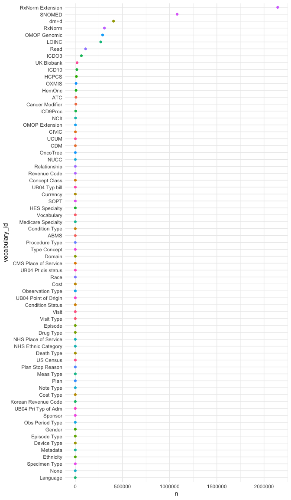

<!-- README.md is generated from README.Rmd. Please edit that file -->
<!-- use devtools::build_readme() -->

# omopcepts

<!-- badges: start -->
<!-- badges: end -->

omopcepts provides access to a subset of **OMOP** con**cepts** and
flexible tidyverse compatible R functions for querying.

The [OMOP Common Data Model](https://ohdsi.github.io/CommonDataModel/)
is an open standard for health data. “\[It is\] designed to standardize
the structure and content of observational data and to enable efficient
analyses that can produce reliable evidence”.

## Installation

Install the development version of omopcepts from
[GitHub](https://github.com/) with:

``` r
# install.packages("remotes")
remotes::install_github("andysouth/omopcepts")
```

## Example showing what vocabularies are included

Later there may be options to include more.

``` r

library(omopcepts)
library(dplyr)

## showing what vocabs are included
concept |> count(vocabulary_id)
#> # A tibble: 3 × 2
#>   vocabulary_id         n
#>   <chr>             <int>
#> 1 Cancer Modifier    6043
#> 2 LOINC            265076
#> 3 SNOMED          1054935
```

### Numbers of concepts in the package by domain and vocabulary

``` r
library(ggplot2)
library(forcats)

ggplot(concept, aes(y=fct_rev(fct_infreq(domain_id)), 
                    fill=vocabulary_id)) +
  geom_bar() +
  labs(y = "domain_id") +
  theme_minimal()
```


